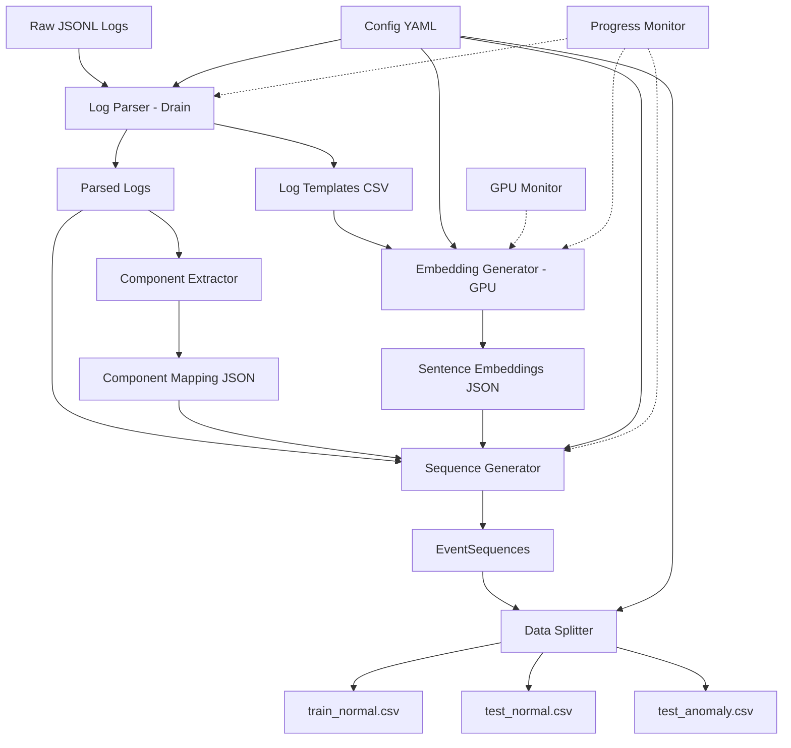

# Design Document

## Overview

The CSCLog Data Preprocessing Pipeline is a GPU-accelerated system that transforms raw JSONL log files into structured datasets suitable for training the CSCLog anomaly detection model. The pipeline consists of five main stages: log parsing, embedding generation, component mapping, sequence generation, and data splitting. The design prioritizes GPU utilization for embedding generation and efficient memory management for processing large datasets.

## Architecture

### High-Level Architecture



### Component Architecture

The system follows a modular pipeline architecture with the following components:

1. **Configuration Manager**: Loads and validates pipeline parameters
2. **Log Parser**: Implements Drain algorithm for template extraction
3. **Embedding Generator**: GPU-accelerated BERT-based embedding creation
4. **Component Extractor**: Maps log metadata to component IDs
5. **Sequence Generator**: Creates EventSequences with sliding windows
6. **Data Splitter**: Splits data into train/validation/test sets
7. **Monitoring System**: Tracks GPU usage, memory, and progress

## Components and Interfaces

### 1. Configuration Manager

**Purpose**: Load, validate, and provide access to pipeline configuration parameters.

**Interface**:
```python
class ConfigManager:
    def __init__(self, config_path: str = "config.yaml"):
        """Load configuration from YAML file"""
        
    def get(self, key: str, default: Any = None) -> Any:
        """Get configuration value with optional default"""
        
    def validate(self) -> bool:
        """Validate all configuration parameters"""
        
    @property
    def window_size(self) -> int:
        """Get sliding window size (6-14)"""
        
    @property
    def batch_size(self) -> int:
        """Get batch size for GPU processing (1-256)"""
        
    @property
    def bert_model(self) -> str:
        """Get BERT model path or name"""
```

**Configuration Schema**:
```yaml
# config.yaml
input:
  raw_log_path: "dataset/data_full.jsonl"
  output_dir: "dataset/processed"

parsing:
  depth: 4  # Drain tree depth
  similarity_threshold: 0.4
  max_children: 100

embedding:
  model_name: "model/bert"  # Local BERT model path
  batch_size: 128  # Optimized for V100 16GB
  max_batch_size: 256  # V100 can handle larger batches
  device: "cuda"  # or "cpu"
  max_length: 512
  use_fp16: true  # Enable mixed precision for V100

sequence:
  window_size: 9
  session_type: "sliding"  # or "time_window"
  time_window_seconds: 10

splitting:
  train_ratio: 0.7
  val_ratio: 0.15
  test_ratio: 0.15
  random_seed: 42

monitoring:
  enable_gpu_monitor: true
  enable_progress_bar: true
  log_interval_seconds: 5
```

### 2. Log Parser (Drain Algorithm)

**Purpose**: Parse raw log messages to extract templates and assign EventIds.

**Interface**:
```python
class DrainParser:
    def __init__(self, depth: int = 4, similarity_threshold: float = 0.4):
        """Initialize Drain parser with tree depth and similarity threshold"""
        
    def parse(self, log_messages: List[Dict]) -> Tuple[pd.DataFrame, Dict[str, int]]:
        """
        Parse log messages and return templates and event mapping
        
        Returns:
            templates_df: DataFrame with columns [EventId, EventTemplate, Occurrences]
            event_mapping: Dict mapping log_index -> EventId
        """
        
    def save_templates(self, output_path: str):
        """Save log templates to CSV file"""
```

**Algorithm Flow**:
1. Extract log message content from JSONL
2. Tokenize message into words
3. Traverse Drain tree based on token count and first token
4. Compare with existing templates using similarity threshold
5. Create new template if no match found
6. Assign EventId to log entry

### 3. Embedding Generator

**Purpose**: Generate GPU-accelerated sentence embeddings for log templates using BERT.

**Interface**:
```python
class EmbeddingGenerator:
    def __init__(self, model_name: str, batch_size: int = 64, device: str = "cuda"):
        """Initialize BERT model on specified device"""
        
    def generate_embeddings(self, templates: Dict[str, str]) -> Dict[str, List[float]]:
        """
        Generate embeddings for all templates with GPU batching
        
        Args:
            templates: Dict mapping EventId -> template_text
            
        Returns:
            embeddings: Dict mapping EventId -> 768-dim vector
        """
        
    def _batch_encode(self, texts: List[str]) -> torch.Tensor:
        """Encode batch of texts on GPU"""
        
    def save_embeddings(self, embeddings: Dict, output_path: str):
        """Save embeddings to JSON file"""
        
    def get_gpu_memory_usage(self) -> float:
        """Return current GPU memory usage in MB"""
```

**GPU Optimization Strategy**:
- Use dynamic batching: start with configured batch_size, adjust based on GPU memory
- Implement gradient-free inference with `torch.no_grad()`
- Use mixed precision (FP16) if GPU supports it
- Pin memory for faster CPU-GPU transfers
- Clear CUDA cache between large batches

**Batching Logic**:
```python
def adaptive_batch_processing(templates, initial_batch_size):
    batch_size = initial_batch_size
    results = {}
    
    for i in range(0, len(templates), batch_size):
        try:
            batch = templates[i:i+batch_size]
            embeddings = model.encode(batch)
            results.update(embeddings)
            
            # Increase batch size if GPU memory < 70%
            if gpu_memory_usage() < 0.7:
                batch_size = min(batch_size * 1.5, max_batch_size)
                
        except RuntimeError as e:  # OOM error
            if "out of memory" in str(e):
                batch_size = max(batch_size // 2, 1)
                torch.cuda.empty_cache()
                continue
            raise
    
    return results
```

### 4. Component Extractor

**Purpose**: Extract and map component information from log metadata.

**Interface**:
```python
class ComponentExtractor:
    def __init__(self):
        """Initialize component mapping"""
        self.component_map: Dict[str, int] = {}
        self.next_id: int = 0
        
    def extract_components(self, logs: List[Dict]) -> Tuple[List[int], Dict[str, int]]:
        """
        Extract component IDs from log entries
        
        Returns:
            component_ids: List of component IDs for each log
            component_map: Dict mapping component_name -> component_id
        """
        
    def _get_component_name(self, log_entry: Dict) -> str:
        """Extract component name from log entry (service > host > default)"""
        
    def save_mapping(self, output_path: str):
        """Save component mapping to JSON file"""
```

**Component Priority**:
1. Use `service` field if available
2. Fall back to `host` field
3. Use "unknown" if neither available
4. Assign component_id = -1 for missing/unknown

### 5. Sequence Generator

**Purpose**: Create EventSequences from parsed logs using sliding windows or time-based sessions.

**Interface**:
```python
class SequenceGenerator:
    def __init__(self, window_size: int = 9, session_type: str = "sliding"):
        """Initialize sequence generator with window configuration"""
        
    def generate_sequences(
        self,
        logs: List[Dict],
        event_mapping: Dict[int, str],
        component_ids: List[int]
    ) -> pd.DataFrame:
        """
        Generate EventSequences from logs
        
        Returns:
            DataFrame with columns: [SessionId, EventSequence, Label]
            EventSequence format: List of (EventId, Component, Timestamp) tuples
        """
        
    def _sliding_window(self, events: List[Tuple]) -> List[List[Tuple]]:
        """Apply sliding window to create sequences"""
        
    def _time_window(self, events: List[Tuple], window_seconds: int) -> List[List[Tuple]]:
        """Group events by time windows"""
        
    def save_sequences(self, sequences: pd.DataFrame, output_path: str):
        """Save sequences to CSV file"""
```

**Sequence Format**:
```python
# EventSequence example
[
    ("E001", 0, "2026-04-20T17:24:01.918+09:00"),
    ("E002", 0, "2026-04-20T17:24:01.920+09:00"),
    ("E001", 1, "2026-04-20T17:24:01.929+09:00"),
    ...
]
```

### 6. Data Splitter

**Purpose**: Split processed sequences into training, validation, and test sets.

**Interface**:
```python
class DataSplitter:
    def __init__(self, train_ratio: float = 0.7, val_ratio: float = 0.15, seed: int = 42):
        """Initialize splitter with ratios and random seed"""
        
    def split(
        self,
        sequences: pd.DataFrame,
        stratify_by: str = "Label"
    ) -> Tuple[pd.DataFrame, pd.DataFrame, pd.DataFrame]:
        """
        Split sequences into train/val/test sets
        
        Returns:
            train_df, val_df, test_df
        """
        
    def save_splits(self, train_df, val_df, test_df, output_dir: str):
        """Save splits to separate CSV files"""
```

**Splitting Strategy**:
- Normal sequences: 70% train, 15% val, 15% test
- Anomaly sequences: 0% train, 50% val, 50% test
- Use stratified sampling to maintain label distribution
- Apply random seed for reproducibility

### 7. Monitoring System

**Purpose**: Track GPU utilization, memory usage, and processing progress.

**Interface**:
```python
class GPUMonitor:
    def __init__(self, device_id: int = 0):
        """Initialize GPU monitor for specified device"""
        
    def get_memory_usage(self) -> Dict[str, float]:
        """Return GPU memory stats (used, total, percentage)"""
        
    def get_utilization(self) -> float:
        """Return GPU utilization percentage"""

class ProgressMonitor:
    def __init__(self, total_steps: int, description: str = "Processing"):
        """Initialize progress bar"""
        
    def update(self, n: int = 1):
        """Update progress by n steps"""
        
    def set_postfix(self, **kwargs):
        """Update progress bar postfix with stats"""
```

## Data Models

### Input Data Model (JSONL)

```python
@dataclass
class RawLogEntry:
    timestamp: str  # ISO8601 format
    service: str
    source: str
    level: str
    filepath: str
    message: str
    pid: str
    host: str
```

### Intermediate Data Models

```python
@dataclass
class ParsedLog:
    log_index: int
    event_id: str
    component: str
    timestamp: str
    message: str
    
@dataclass
class LogTemplate:
    event_id: str
    template: str
    occurrences: int
    
@dataclass
class EventSequence:
    session_id: str
    events: List[Tuple[str, int, str]]  # (EventId, ComponentId, Timestamp)
    label: int  # 0=normal, 1=anomaly
```

### Output Data Models

**log_templates.csv**:
```
EventId,EventTemplate,Occurrences
E001,"Unhandled exception",7
E002,"Manager for service <*> <*> is reporting problems",2
...
```

**sentences_emb.json**:
```json
{
  "E001": [0.123, -0.456, 0.789, ...],  // 768 dimensions
  "E002": [0.234, -0.567, 0.890, ...],
  ...
}
```

**component.json**:
```json
{
  "gnocchi": 0,
  "cinder": 1,
  "fluent-bit": 2,
  ...
}
```

**train_normal.csv**:
```
SessionId,EventSequence,Label
S001,"[('E001', 0, '2026-04-20T17:24:01.918+09:00'), ...]",0
...
```

## Error Handling

### Error Categories and Strategies

1. **Configuration Errors**:
   - Invalid parameter values → Raise ValueError with descriptive message
   - Missing config file → Use default values and log warning
   - Invalid file paths → Raise FileNotFoundError

2. **GPU Errors**:
   - CUDA out of memory → Reduce batch size by 50%, clear cache, retry
   - No GPU available → Fall back to CPU with warning
   - GPU driver issues → Raise RuntimeError with diagnostic info

3. **Data Errors**:
   - Malformed JSONL → Skip invalid lines, log warning
   - Missing required fields → Use default values or skip entry
   - Invalid timestamps → Use epoch time or skip entry

4. **Memory Errors**:
   - RAM exhaustion → Trigger garbage collection, reduce chunk size
   - Disk space full → Raise IOError with space requirements

### Error Handling Pattern

```python
class PipelineError(Exception):
    """Base exception for pipeline errors"""
    pass

class ConfigurationError(PipelineError):
    """Configuration validation errors"""
    pass

class GPUError(PipelineError):
    """GPU-related errors"""
    pass

def safe_gpu_operation(func):
    """Decorator for GPU operations with automatic fallback"""
    def wrapper(*args, **kwargs):
        try:
            return func(*args, **kwargs)
        except RuntimeError as e:
            if "out of memory" in str(e):
                torch.cuda.empty_cache()
                # Retry with smaller batch
                return func(*args, batch_size=kwargs.get('batch_size', 64) // 2)
            raise GPUError(f"GPU operation failed: {e}")
    return wrapper
```

## Testing Strategy

### Unit Tests

1. **Configuration Manager**:
   - Test valid/invalid parameter validation
   - Test default value loading
   - Test YAML parsing

2. **Log Parser**:
   - Test template extraction accuracy
   - Test EventId assignment consistency
   - Test edge cases (empty logs, special characters)

3. **Embedding Generator**:
   - Test batch processing logic
   - Test GPU memory management
   - Test CPU fallback
   - Mock BERT model for faster tests

4. **Component Extractor**:
   - Test component ID assignment
   - Test priority logic (service > host)
   - Test missing field handling

5. **Sequence Generator**:
   - Test sliding window logic
   - Test time window grouping
   - Test sequence format correctness

6. **Data Splitter**:
   - Test split ratios
   - Test stratification
   - Test reproducibility with seed

### Integration Tests

1. **End-to-End Pipeline**:
   - Test with small sample dataset (100 logs)
   - Verify all output files are created
   - Verify output format matches CSCLog requirements

2. **GPU Integration**:
   - Test with GPU available
   - Test with GPU unavailable (CPU fallback)
   - Test memory management under load

3. **Large Dataset Handling**:
   - Test with 10MB, 100MB, 1GB files
   - Verify memory usage stays within limits
   - Verify processing time scales linearly

### Performance Tests

1. **Throughput Benchmarks**:
   - Measure logs processed per second
   - Measure GPU utilization percentage
   - Compare GPU vs CPU performance

2. **Memory Profiling**:
   - Track peak memory usage
   - Identify memory leaks
   - Verify garbage collection effectiveness

3. **Scalability Tests**:
   - Test with varying dataset sizes
   - Test with different GPU models
   - Test with different batch sizes

### Test Data

Create synthetic test datasets:
- `test_small.jsonl`: 100 logs, 5 templates
- `test_medium.jsonl`: 10,000 logs, 50 templates
- `test_large.jsonl`: 1,000,000 logs, 500 templates
- `test_malformed.jsonl`: Various error conditions

## Performance Considerations

### GPU Optimization

1. **Batch Size Tuning for V100 16GB**:
   - Start with batch_size=128 (V100 optimized)
   - Monitor GPU memory usage
   - Dynamically adjust between 64-256
   - V100 has high memory bandwidth, use larger batches

2. **Memory Management**:
   - Use `torch.no_grad()` for inference
   - Clear CUDA cache between stages
   - Pin memory for data transfers

3. **Model Loading**:
   - Load BERT model once at initialization
   - Keep model on GPU throughout processing
   - Use half precision (FP16) - V100 has Tensor Cores optimized for FP16
   - Enable TF32 for additional speedup on V100

### CPU Optimization

1. **Multiprocessing for 4M records**:
   - Use multiprocessing for log parsing (CPU-bound)
   - Parallel component extraction with 4-8 workers
   - Parallel sequence generation with chunking
   - Balance CPU workers to not bottleneck GPU

2. **Memory Efficiency for 4M records**:
   - Stream large files in 500MB chunks (optimized for 4M records)
   - Write outputs incrementally every 50,000 sequences
   - Use generators instead of lists where possible
   - Implement aggressive garbage collection for large datasets

### Expected Performance

With NVIDIA Tesla V100 (16GB VRAM):
- Embedding generation: ~2000-3000 templates/second (with FP16)
- Log parsing: ~50,000 logs/second
- End-to-end: ~15,000-20,000 logs/second
- Memory usage: <12GB RAM, <14GB VRAM
- Total processing time for 4M records: ~3-5 minutes

## Dependencies

```
# requirements.txt
torch>=1.12.0
transformers>=4.20.0
pandas>=1.4.0
numpy>=1.22.0
pyyaml>=6.0
tqdm>=4.64.0
scikit-learn>=1.1.0
dateutil>=2.8.0
```

## Deployment Considerations

1. **Environment Setup**:
   - CUDA 11.0+ required for V100 support
   - Python 3.9+ required
   - 16GB+ RAM recommended for 4M records
   - Tesla V100 16GB VRAM (sufficient for batch_size=128-256)

2. **Configuration**:
   - Provide template config.yaml
   - Document all parameters
   - Include validation script

3. **Monitoring**:
   - Log all processing stages
   - Save processing statistics
   - Generate summary report

4. **Error Recovery**:
   - Support resume from checkpoint
   - Save intermediate results
   - Provide cleanup utilities
